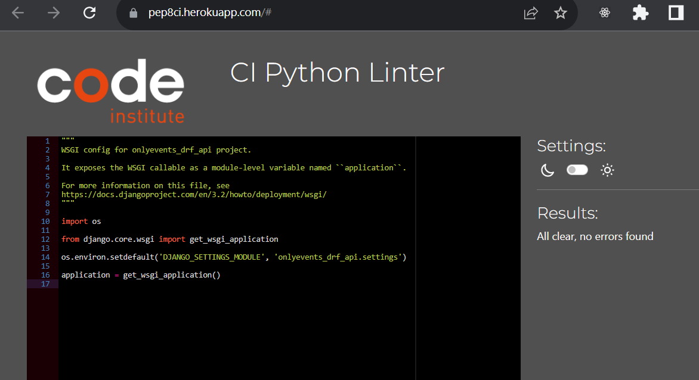
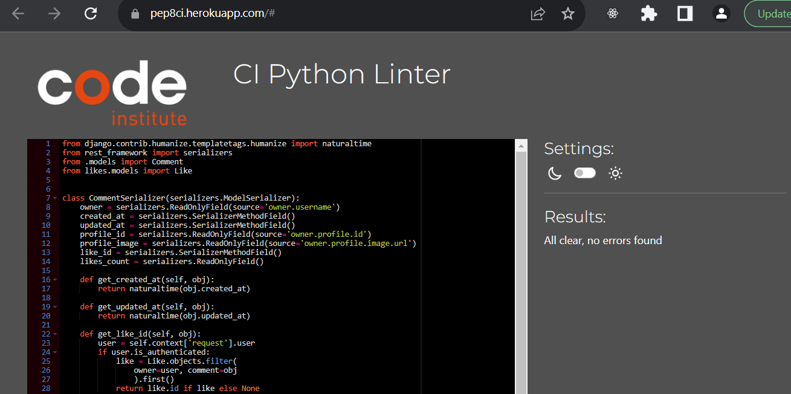
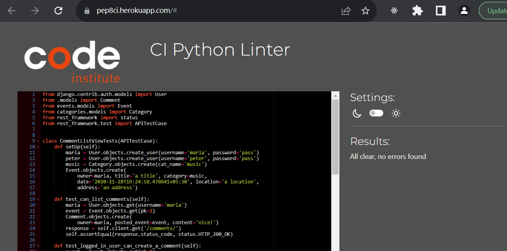

# Only Events DRF API

This repository is the back-end REST API used by the front-end project Only Events.

Visit the deployed website here - <a href="https://onlyevents.herokuapp.com/" target="_blank" rel="noopener">Only Events</a>.

Visit the deployed API here - <a href="https://onlyevents-drf-api.herokuapp.com/" target="_blank" rel="noopener">Only Events</a>.

You can view the front-end README.md here - <a href="https://github.com/MartinaP87/onlyevents87" target="_blank" rel="noopener">Only Events API README</a>

## Table of contents
1. [Project goals](#project-goals)
2. [Entity Relationship Diagram](#entity-relationship-diagram)
3. [Testing](#testing)
   1. [Manual testing](#manual-testing)
   2. [PEP8 validation](#pep8-validation)
      1. [Categories](#categories)
      2. [Comments](#comments)
      3. [Events](#events)
      4. [Followers](#followers)
      5. [Goings](#goings)
      6. [Interesteds](#interesteds)
      7. [Likes](#likes)
      8. [Profiles](#profiles)
4. [Technologies used](#technologies-used)
    1. [Languages](#languages)
    2. [Libraries and Frameworks](#libraries-and-frameworks)
    3. [Packages](#packages)
    4. [Other tools](#other-tools)
5. [Deployment](#deployment)
     1. [Deployment to Heroku](#deployment-to-heroku)
     2. [Local deployment](#local-deployment)

## Project goals

The purpose of this project is to serve information to the user’s interface.
It provides a secure and reliable source of data to be used in the Only Events front-end project.
The API allows transferring of information between the interface and the database, which communicates by sending a .json file.

## Entity Relationship Diagram

The database model has been designed using Figma. 
The diagram shows the relationships between the models in the database.
The database used in development was SQLite3, and in production was  PostgreSQL, hosted by [ElephantSQL](https://www.elephantsql.com/).

## Testing

### Manual Testing
<table>
<thead>
<tr>
<th>Action or Event</th>
<th>Expected Result</th>
<th>Successful?<th>
</tr>
</thead>
<tbody>
<tr>
<td>Add paths to the URL as logged out user</td>
</tr>
<tr>
<td>

- path 'admin/',
- path 'api-auth/login/',
- path 'api-auth/logout/'
</td>
<td>Open the page with no errors and return the relevant data.</td>
<td>Yes</td>
</tr>
<tr>
<td>

- path 'profiles/',
- path 'profiles/valid id/',
- path 'profiles/invalid id/',
- path 'profiles/preferences/',
- path 'profiles/preferences/valid id/'
- path 'profiles/preferences/invalid id/'
</td>
<td>Open the page with no errors and return the relevant data without create, update, and delete functionality.</td>
<td>Yes</td>
</tr>
<tr>
<td>

- path 'categories/',
- path 'categories/genres/',
- path 'categories/valid id/',
- path 'categories/invalid id/',
- path 'categories/genres/valid id/'
- path 'categories/genres/invalid id/'
</td>
<td>Open the page with no errors and return the relevant data without create, update, and delete functionality.</td>
<td>Yes</td>
</tr>
<tr>
<td>

- path 'events/',
- path 'events/valid id/',
- path 'events/invalid id',
- path 'events/galleries/',
- path 'events/galleries/valid id',
- path 'events/galleries/invalid id',
- path 'events/galleries/photos',
- path 'events/galleries/photos/valid id',
- path 'events/galleries/photos/invalid id',
- path 'events/genres',
- path 'events/genres/valid id'
- path 'events/genres/invalid id'
</td>
<td>Open the page with no errors and return the relevant data without create, update, and delete functionality.</td>
<td>Yes</td>
</tr>
<tr>
<td>
    
- path 'interested/',
- path 'interested/valid id/',
- path 'interested/invalid id/',
- path 'going/',
- path 'going/valid id/',
- path 'going/invalid id/',
- path 'likes/',
- path 'likes/valid id/'
- path 'likes/invalid id/'
</td>
<td>Open the page with no errors and return the relevant data without create, update, and delete functionality.</td>
<td>Yes</td>
</tr>
<tr>
<td>    

- path 'comments/',
- path 'comments/valid id/'
- path 'comments/invalid id/'
</td>
<td>Open the page with no errors and return the relevant data without create, update, and delete functionality.</td>
<td>Yes</td>
</tr>
<tr>
<td>
    
- path 'followers/',
- path 'followers/valid id/'
- path 'followers/invalid id/'
</td>
<td>Open the page with no errors and return the relevant data.</td>
<td>Yes</td>
</tr>

<tr>
<td>Testing URLS paths as logged in user</td>
</tr>
<tr>
<td>

- path 'admin/',
- path 'api-auth/login/',
- path 'api-auth/logout/'
</td>
<td>Open the page with no errors and return the relevant data.</td>
<td>Yes</td>
</tr>
<tr>
<td>

- path 'profiles/',
- path 'profiles/other user id',
- path 'profiles/invalid id',
- path 'profiles/preferences/',
- path 'profiles/preferences/other user id'
- path 'profiles/preferences/invalid id'
</td>
<td>Open the page with no errors and return the relevant data without create, update, and delete functionality.</td>
<td>Yes</td>
</tr>
<tr>
<td>

- path 'profiles/current user id',
- path 'profiles/preferences/current user id'
</td>
<td>Open the page with no errors and return the relevant data. The current user can update and delete their data.</td>
<td>Yes</td>
</tr>
<tr>
<td>

- path 'categories/',
- path 'categories/valid id',
- path 'categories/invalid id',
- path 'categories/genres/',
- path 'categories/genres/valid id'
- path 'categories/genres/invalid id'
</td>
<td>Open the page with no errors and return the relevant data without create, update, and delete functionality.</td>
<td>Yes</td>
</tr>
<tr>
<td>

- path 'categories/',
- path 'categories/genres/'
</td>
<td>If the logged in user is the admin retreive the relevant data, and enable update and delete functionality.</td>
<td>Yes</td>
</tr>
<tr>
<td>

- path 'categories/valid id',
- path 'categories/genres/valid id'
</td>
<td>If the logged in user is the admin retreive the relevant data, and enable update and delete functionality.</td>
<td>Yes</td>
</tr>
<tr>
<td>

- path 'events/valid id',
- path 'events/invalid id',
- path 'events/galleries/',
- path 'events/galleries/valid id',
- path 'events/galleries/invalid id',
- path 'events/galleries/photos/valid id',
- path 'events/galleries/photos/invalid id',
- path 'events/genres',
- path 'events/genres/valid id',
- path 'events/genres/invalid id'
</td>
<td>If the logged in user is not the event owner, nor the photos owner, open the pages with no errors and return the relevant data without create, update, and delete functionality.</td>
<td>Yes</td>
</tr>
<tr>
<td>
- path 'events/',
- path 'events/invalid id',
- path 'events/galleries/photos',
- path 'events/galleries/photos/valid id',
</td>
<td>Any logged in user can create events and add photos to others events. They can also update and delete their own photos.
They can also update and delete them.</td>
<td>Yes</td>
</tr>
<tr>
<td>

- path 'events/invalid id',
- path 'events/galleries/invalid id',
- path 'events/genres/valid id',
- path 'events/galleries/photos/valid id',
</td>
<td>If the logged in user is the event owner, they can update and delete the event, the genres, and their own photos.
The can also update the gallery, but not delete it or create it, since it creates automatically when the event is created.</td>
<td>Yes</td>
</tr>

<tr>
<td>
    
- path 'interested/',
- path 'interested/valid id/',
- path 'interested/invalid id/',
- path 'going/',
- path 'going/valid id/',
- path 'going/invalid id/',
- path 'likes/',
- path 'likes/valid id/'
- path 'likes/invalid id/'
</td>
<td>Any authenticated user can retrieve a list of interested, going and likes data. They can also show interest or go to an event. Any authenticated user can like a comment.</td>
<td>Yes</td>
</tr>
<tr>
<td>
    
- path 'interested/',
- path 'interested/valid id/',
- path 'interested/invalid id/',
- path 'going/',
- path 'going/valid id/',
- path 'going/invalid id/',
- path 'likes/',
- path 'likes/valid id/'
- path 'likes/invalid id/'
</td>
<td>If the logged in user is the owner of the interested, going and likes data, they can update and delete the data.</td>
<td>Yes</td>
</tr>
<tr>
<td>    

- path 'comments/',
- path 'comments/valid id/'
- path 'comments/invalid id/'
</td>
<td>Any authenticated user can retrieve and create comments.</td>
<td>Yes</td>
</tr>
<tr>
<td>

- path 'comments/valid id/'
</td>
<td>If the logged in user is the comment owner, they can also <td>Yes</td>
</tr>
<tr>
<td>
    
- path 'followers/',
- path 'followers/valid id/'
- path 'followers/invalid id/'
</td>
<td>Any authenticated user can view a list of followers and follow a profile.</td>
<td>Yes</td>
</tr>
<tr>
<td>

- path 'followers/valid id/'</td>
<td>If the logged in user is the owner of the follower data, they can delete it.</td>
<td>Yes</td>
</tr>
</tbody>
</table>

### PEP8 validation

#### Onlyevents_drf_api

**premissions.py**

**serializers.py**

**settings.py**

**urls.py**

**views.py**

**wsgi**

#### Categories

**admin.py**

**models.py**

**serializers.py**

**tests.py**

**urls.py**

**views.py**

#### Comments

**models.py**

**serializers.py**

**tests.py**

**urls.py**

**views.py**

#### Events

**admin.py**

**models.py**

**serializers.py**

**tests.py**

**urls.py**

**views.py**

#### Followers

**models.py**

**serializers.py**

**tests.py**

**urls.py**

**views.py**

#### Goings

**models.py**

**serializers.py**

**tests.py**

**urls.py**

**views.py**

#### Interesteds

**models.py**

**serializers.py**

**tests.py**

**urls.py**

**views.py**

#### Likes

**models.py**

**serializers.py**

**tests.py**

**urls.py**

**views.py**

#### Profiles

**admin.py**

**models.py**

**serializers.py**

**tests.py**

**urls.py**

**views.py**

## Bugs

- On the front-end project, the forms weren't displaying the error messages. Looking at the API I realized that in the Categories, Events, and  Profiles serializers, I missed raising the ValidartionError in case of an IntegrityError. Adding them fixed the issue;
- When trying to view the app after the successful deployment, it would open a page displaying an "Application error" message.
After a thorough check, I realized that I miss-spelled the name of my project in the Procfile. Correcting the spelling fixed the issue.

## Technologies Used

### Languages

- [Python](https://www.python.org/) - A high-level, general-purpose programming language

### Libraries and Frameworks

- [Django](https://pypi.org/project/Django/) - A high-level Python web framework that encourages rapid development and clean, pragmatic design.
- [Django REST Framework](https://pypi.org/project/djangorestframework/) - A powerful and flexible toolkit for building Web APIs

### Packages

- [asgiref](https://pypi.org/project/asgiref/) -A standard for Python asynchronous web apps and servers to communicate with each other.
- [cloudinary](https://pypi.org/project/cloudinary/) -  a powerful media API for websites and mobile apps.
- [dj-database-url](https://pypi.org/project/dj-database-url/) - Django utility that allows to utilize the 12factor inspired DATABASE_URL environment variable to configure your Django application.
- [dj-rest-auth](https://pypi.org/project/dj-rest-auth/) - API endpoints for handling authentication securely in Django Rest Framework.
- [django-allauth](https://pypi.org/project/django-allauth/) - Integrated set of Django applications addressing authentication, registration, and account management.
- [django-cloudinary-storage](https://pypi.org/project/django-cloudinary-storage/) - Django package that provides Cloudinary storage for both media and static files.
- [django-cors-headers](https://pypi.org/project/django-cors-headers/) - A Django App that adds Cross-Origin Resource Sharing (CORS) headers to responses. It allows in-browser requests to the Django application from other origins.
- [django-filter](https://pypi.org/project/django-filter/) -  A reusable Django application allowing users to declaratively add dynamic QuerySet filtering from URL parameters.
- [djangorestframework-simplejwt](https://pypi.org/project/djangorestframework-simplejwt/) - A JSON Web Token authentication plugin for the Django REST Framework.
- [gunicorn](https://pypi.org/project/gunicorn/) - a Python WSGI HTTP Server for UNIX.
- [oauthlib](https://pypi.org/project/oauthlib/) - A framework that implements the logic of OAuth1 or OAuth2 without assuming a specific HTTP request object or web framework.
- [Pillow](https://pypi.org/project/Pillow/) - A Python Imaging Library that adds support for opening, manipulating, and saving many different image file formats.
- [psycopg2](https://pypi.org/project/psycopg2/) - PostgreSQL database adapter for Python.
- [PyJWT](https://pypi.org/project/PyJWT/) - A Python library that allows you to encode and decode JSON Web Tokens (JWT).
- [python3-openid](https://pypi.org/project/python3-openid/) - A set of Python packages to support the use of the OpenID decentralized identity system in your application.
- [pytz](https://pypi.org/project/pytz/) - A library that allows accurate and cross-platform timezone calculations.
- [requests-oauthlib](https://pypi.org/project/requests-oauthlib/) - OAuth library support for Requests.
- [sqlparse](https://pypi.org/project/sqlparse/) -  A non-validating SQL parser for Python. It provides support for parsing, splitting, and formatting SQL statements.

### Other Tools

- [GitHub](https://github.com/) - Used to host and deploy the website as well as manage the project.
- [GitPod](https://www.gitpod.io/) - A cloud development environment for teams to efficiently and securely develop software. I
- [Heroku](https://dashboard.heroku.com) - Used to deploy the website
- [SQLite](https://www.sqlite.org/index.html) - An open-source, zero-configuration, self-contained, stand-alone, transaction relational database engine designed to be embedded into an application.
- [ElephantSQL](https://www.elephantsql.com/) -  A PostgreSQL database hosting service.
It manages administrative tasks of PostgreSQL, such as installation, upgrades to the latest stable version, and backup handling. ElephantSQL is also integrated into several cloud application platforms (also known as PaaS).
- [Cloudinary](https://cloudinary.com/) - Used to host all static files.
- [Figma]() - A browser-based, collaborative user interface design tool used to create the ERD.
- [CI PEP8 Linter](https://pep8ci.herokuapp.com/#) - Used to check the Python code for any linting issues.

## Deployment

### Deployment to Heroku

The project was deployed to [Heroku](https://www.heroku.com). The deployment process is as follows:

Create the database with [ElephantSQL](https://www.elephantsql.com/):

- Log into ElephantSQL;
- Click **Create New Instance**;
- Give your plan a Name (the name of the project);
- Select the **Tiny Turtle (Free)** plan;
- Click **Select Region** and pick the data center closest to you;
- Click **Review**, and check that your details are correct;
- Click **Create instance**.

Get the database URL:

- Return to the ElephantSQL dashboard and click on the **database instance name** for this project;
- In the URL section, click the copy icon;

 Head to Heroku and create the app:
Log into Heroku and go to the Dashboard;

- Click **New**;
- Click **Create new app**;
- Give your app a unique name;
- Select the region closest to you;
- Click **Create app** to confirm.

Connect the database to your app:

- In the app, open the **Settings** tab;
- Scroll down and click **Reveal Config Vars**;
- Type in the KEY field **DATABASE_URL** and paste in the VALUE field the database - URL  from ElephantSQL (do not add quotation marks);
- Click **Add**.

Back in the Gitpod repository, we can set up the project to connect to the - ElephantSQL database, create the database tables by running migrations, and confirm that it all works by creating a superuser.

- In the terminal, install dj_database_url and psycopg2 by typing: 
      **pip3 install dj_database_url==0.5.0 psycopg2** ;
- In the settings.py file, import dj_database_url underneath the import for os: **import dj_database_url** ;
- Update the DATABASES section to the following:

 if 'DEV' in os.environ:
     DATABASES = {
         'default': {
             'ENGINE': 'django.db.backends.sqlite3',
             'NAME': BASE_DIR / 'db.sqlite3',
         }
     }
 else:
     DATABASES = {
         'default': dj_database_url.parse(os.environ.get("DATABASE_URL"))
     }

- In your env.py file, add a new environment variable:

 os.environ.setdefault("DATABASE_URL", "<ElephantSQL database URL here>")

- Temporarily comment out the DEV environment variable so that Gitpod can connect to your external database: 

 # os.environ['DEV'] = '1'

- Back in your settings.py file, add a print statement to confirm you have connected to the external database in the else statement in the database section:

 else:
      DATABASES = {
         'default': dj_database_url.parse(os.environ.get("DATABASE_URL"))
     }
     **print("connected")**

- To confirm that the external database is connected, type in the terminal:

 -–dry-run your makemigrations

 - If you see the **connected** message printed to the terminal the external database is connected, so you can delete the print statement and migrate your database models to your new database by typing in the terminal:

 python manage.py migrate

- Now create a superuser for your new database by typing in the terminal:

 python3 manage.py createsuperuser

- Follow the steps to create the superuser username and password;

Now we head back to ElephantSQL to confirm that the data in the external database has been created.

- On the ElephantSQL page for your database, in the left side navigation, select **BROWSER**;
- Click **Table queries**;
- Select **auth_user**;
- Click **Execute**;
- If the superuser details are displayed your tables have been created and you can add data to your database.

Now we need to head back to our project to prepare it for deployment by installing a package to run the project on Heroku, fixing a few environment variables, and creating a Procfile file that will provide the commands to Heroku to build and run the project.

-In the terminal of the GitPod workspace, install gunicorn by typing:

 pip3 install gunicorn django-cors-headers

- Update your requirements.txt by typing in the terminal:

 pip freeze --local > requirements.txt

- In the root, create the **Procfile**.  It must be named correctly and not have any file extension;
- Inside the Procfile, add these two commands

 release: python manage.py makemigrations && python manage.py migrate
 web: gunicorn <name of your project>.wsgi

- In  settings.py, update the value of the **ALLOWED_HOSTS** variable:

 ALLOWED_HOSTS = ['localhost', '<your_app_name>.herokuapp.com']

 - Add corsheaders to **INSTALLED_APPS**:

 INSTALLED_APPS = [
    ...
    'dj_rest_auth.registration',
    'corsheaders',
    ...
 ]

- Add corsheaders middleware to the TOP of the **MIDDLEWARE**:

 SITE_ID = 1
 MIDDLEWARE = [
     'corsheaders.middleware.CorsMiddleware',
     ...
 ]

- Under the **MIDDLEWARE** list, set the ALLOWED_ORIGINS for the network requests made to the server with the following code:

 if 'CLIENT_ORIGIN' in os.environ:
     CORS_ALLOWED_ORIGINS = [
         os.environ.get('CLIENT_ORIGIN')
     ]
 else:
     CORS_ALLOWED_ORIGIN_REGEXES = [
         r"^https://.*\.gitpod\.io$",
     ]

- Enable sending cookies in cross-origin requests so that users can get authentication functionality by adding under the previous code:

 CORS_ALLOW_CREDENTIALS = True

- To be able to have the front-end app and the API deployed to different platforms, set the JWT_AUTH_SAMESITE attribute to **None**:

 JWT_AUTH_COOKIE = 'my-app-auth'
 JWT_AUTH_REFRESH_COOKE = 'my-refresh-token'
 JWT_AUTH_SAMESITE = 'None'

- Remove the value for SECRET_KEY and replace it with the following code to use an environment variable instead:

 SECRET_KEY = os.getenv('SECRET_KEY')

- Set a NEW value for your **SECRET_KEY** environment variable in env.py:

 os.environ.setdefault("SECRET_KEY", "CreateANEWRandomValueHere")

- Set the DEBUG value to be True only if the DEV environment variable exists. This will mean it is True in development, and False in production:

 DEBUG = 'DEV' in os.environ

- Comment DEV back in env.py:

 os.environ['DEV'] = '1'

- Ensure the project requirements.txt file is up to date by typing in the terminal: 
 
 pip freeze --local > requirements.txt

- Add, commit and push your code to GitHub.

Now we can deploy the project on Heroku:

- On the Heroku dashboard of your new app, open the **Settings** tab;
- Click **Reveal Config Vars** ;
- Add:
KEY field: **SECRET_KEY**, VALUE field:  make one up a secret key, but don’t use the one that was originally in the settings.py file!
KEY field: **CLOUDINARY_URL**, VALUE field: copy in your Cloudinary URL from your env.py file (do not add quotation marks!)

- Open the **Deploy** tab;
- In the **Deployment method** section, select **Connect to GitHub**;
- Search for your repo by typing its name on the **repo-name** field;
- Click **Connect**;
- Scroll down to the  **Manual deploy** section and click **Deploy Branch; this will start the build process.
- When the build is finished, it will display the success message **Your app was successfully deployed**

Now, since dj-rest-auth has a bug that doesn’t allow users to log out, we have to write the logout view, where we set both cookies to an empty string and pass additional attributes like secure, httponly, and samesite, which was left out by mistake by the library.
The steps to do are the following:

- In drf_api/views.py, import JWT_AUTH settings from settings.py like so:
- In drf_api/views.py, import JWT_AUTH settings from settings.py like so:
Under **from rest_framework.response import Response** type:

 from .settings import (
    JWT_AUTH_COOKIE, JWT_AUTH_REFRESH_COOKIE,
    JWT_AUTH_SAMESITE, JWT_AUTH_SECURE, )

- Write a logout view. Looks like quite a bit, but all that’s happening here is that we’re setting the value of both the access token (JWT_AUTH_COOKIE) and refresh token (JWT_AUTH_REFRESH_COOKIE) to empty strings. We also pass samesite=JWT_AUTH_SAMESITE, which we set to ’None’ in settings.py and make sure the cookies are httponly and sent over HTTPS:

 @api_view(['POST'])
 def logout_route(request):
     response = Response()
     response.set_cookie(
         key=JWT_AUTH_COOKIE,
         value='',
         httponly=True,
         expires='Thu, 01 Jan 1970 00:00:00 GMT',
         max_age=0,
         samesite=JWT_AUTH_SAMESITE,
         secure=JWT_AUTH_SECURE,
     )
     response.set_cookie(
         key=JWT_AUTH_REFRESH_COOKIE,
         value='',
         httponly=True,
         expires='Thu, 01 Jan 1970 00:00:00 GMT',
         max_age=0,
         samesite=JWT_AUTH_SAMESITE,
         secure=JWT_AUTH_SECURE,
     )
     return response

- Now import the logout_route and include the logout view in drf_api/urls.py. It's important to place the logout_route above the default dj-rest-auth urls, so that it is matched first. Under **from django.urls import path, include**, type:

 from .views import root_route, logout_route

- In the urlpatterns list:

 path('dj-rest-auth/logout/', logout_route),
 path('dj-rest-auth/', include('dj_rest_auth.urls')),

- Add, commit, and push your code to Gitpod.
- Return to Heroku, in the Deploy tab, and Manually Deploy your code again.

To use this API with a React project, we have to add two environment variables in the SETTINGS.py file.
ALLOWED_HOST, so that it’s not hardcoded and you could spin up multiple API instances, as they would all be deployed to different URLs.
CLIENT_ORIGIN_DEV, so that you can access your deployed API when developing the client-side app in gitpod.

- In settings.py, in the ALLOWED_HOSTS list, copy your ‘... .herokuapp.com’ string.
 ALLOWED_HOSTS = [
    '... .herokuapp.com',
    'localhost',
 ]
- Log in to heroku.com and select your API application.
- Click “settings”
- Click “Reveal config vars”
 -Add:
  KEY field: **ALLOWED_HOST** VALUE field: **your deployed Heroku application URL that we copied from settings.py**
- Back in settings.py, replace your ALLOWED HOSTS list '... .herokuapp.com' string we just copied with the ALLOWED_HOST environment variable by writing:

 ALLOWED_HOSTS = [
   os.environ.get('ALLOWED_HOST'),
   'localhost',
]

To make our application more secure and accommodate the way Gitpod works by changing the workspace URL regularly we could:
 * Extract the unique part of the gitpod preview URL when the CLIENT_ORIGIN_DEV environment variable is defined;
 * Include it in the regular expression provided so that the gitpod workspace is still connected to our API when gitpod rotates the workspace URL.
Import the regular expression module at the top of your settings.py file. We will need this to manipulate the CLIENT_ORIGIN_DEV URL string.

- Import the regular expression module at the top of your settings.py file:

 import re

- Replace the else statement and body for if 'CLIENT_ORIGIN' in os.environ: with the following code:
 if 'CLIENT_ORIGIN_DEV' in os.environ:
    extracted_url = re.match(r'^.+-', os.environ.get('CLIENT_ORIGIN_DEV', ''), re.IGNORECASE).group(0)
    CORS_ALLOWED_ORIGIN_REGEXES = [
        rf"{extracted_url}(eu|us)\d+\w\.gitpod\.io$",
    ]

This code snippet allows our API to talk to our development environment.
The value for CLIENT_ORIGIN_DEV will be set to the gitpod preview URL of the front end project.

- Git add, commit and push the changes to your settings.py file to GitHub;
- Return to your Heroku application for this API project;
- Click on the “Deploy” tab;
- Scroll down and click “Deploy branch”;

Now the project is set up and ready to be used with a React project.

### Local deployment

To work on the code from a local device, the steps to fork/clone the repository are as follows:

**Fork**

- In the top-right corner of the GitHub repository, click Fork;
- Select an owner for the forked repository;
- By default, forks are named the same as their upstream repositories, but you can change the name of the fork;
- Optionally, add a description of your fork;
- Choose whether to copy only the default branch or all branches to the new fork;
- Click Create fork.

**Clone**

- In the GitHub repository, above the list of files, click  **Code**;
- Copy the URL for the repository;
  - To clone the repository using HTTPS, under "HTTPS", click the copy icon.
  - To clone the repository using an SSH key, including a certificate issued by your organization's SSH certificate authority, click SSH, then click the copy icon.
  - To clone a repository using GitHub CLI, click GitHub CLI, then click the copy icon.
- Open Git Bash.
- Change the current working directory to the location where you want the cloned directory.
- Type **git clone**, and then paste the URL you copied earlier.
- Press **Enter**. Your local clone will be created.

## Credits

- [Code Institute](https://codeinstitute.net/) DRF-API walkthrough project 
- [Django REST Framework Documentation](https://www.django-rest-framework.org/api-guide/permissions/) 
- [Stackoverflow](https://stackoverflow.com/)
- I would also like to thank my mentor Marcel for the support!